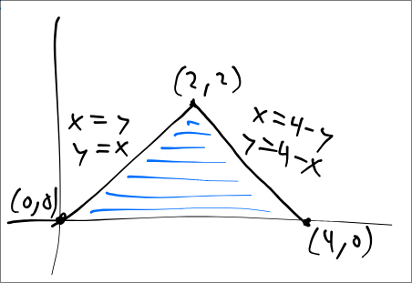

# Bounds of Double Integrals

To set up the bounds of a double integral in vector calculus, you first need to determine the region over which you are integrating. This region can be described in the $xy$-plane.

1. **Identify the region**: Determine the curves or lines that bound the region of integration. For example, if the region is bounded by $y = f_1(x)$ and $y = f_2(x)$ in the interval $[a, b]$, these functions will serve as your bounds for $y$.

2. **Set the bounds**: You can express the double integral as:
   $$ \iint_R f(x, y) \, dA = \int_a^b \int_{f_1(x)}^{f_2(x)} f(x, y) \, dy \, dx $$
   Here, $R$ is the region of integration, $f(x, y)$ is the function being integrated, and $dA$ represents the area element.

3. **Consider cases**: If the region is more complex, you may need to switch the order of integration or split the region into multiple parts. For example, if the region is bounded in $y$ by $g_1(y)$ and $g_2(y)$ and in $x$ by $c_1(y)$ and $c_2(y)$, you can express it as:
   $$ \iint_R f(x, y) \, dA = \int_{c}^{d} \int_{g_1(y)}^{g_2(y)} f(x, y) \, dx \, dy $$
   where $c$ and $d$ are the bounds for $y$.

By following these steps, you can correctly set up the bounds for your double integral.

---

#### Example 

> Which of the following correctly gives the bounds for $\int_D(x+2y)dA$ where $D$ is the triangular region with corners (0,0), (2,2), and (4,0)?

##### 1st Draw Region Described by the Bounds

  

**Observe**: it is much better to set up order of integration to be $d_xd_y$ rather than $d_yd_x$ as the latter would require us to split the integration under two seperate integrals (one for each function)

##### 2nd Find the Bounds

###### Find the Bounds of x 

Our goal here should be to describe x in terms of y 

Observe going from left to right
* The lower bound of x = y (left-most line)
* The upper bound of x = 4-y (right-most line)

###### Find the Bounds of y 

Recall for the outermost integration we should always have real numbers (not variables) as we are always given a value when evaluating double or triple integrals

Observe that for y, the region exists within the range $ 0 \le y \le 2$

##### 3rd Put it All Together

$$\therefore \int_0^2 \int_y^{4-y} (x+2y)d_x d_y$$

